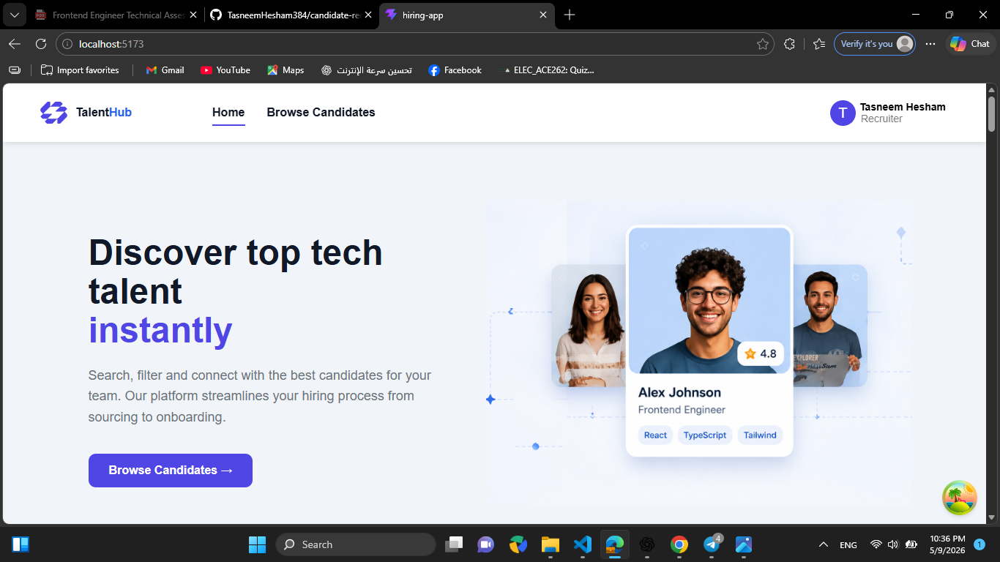
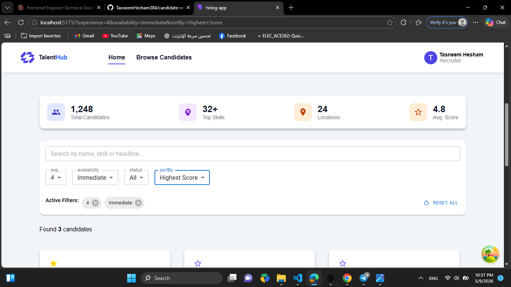
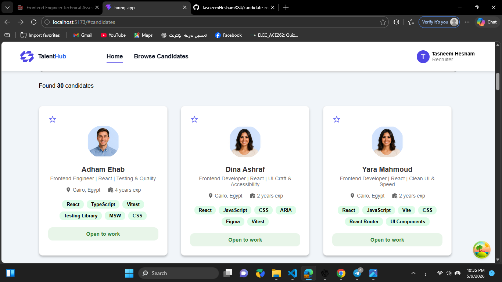
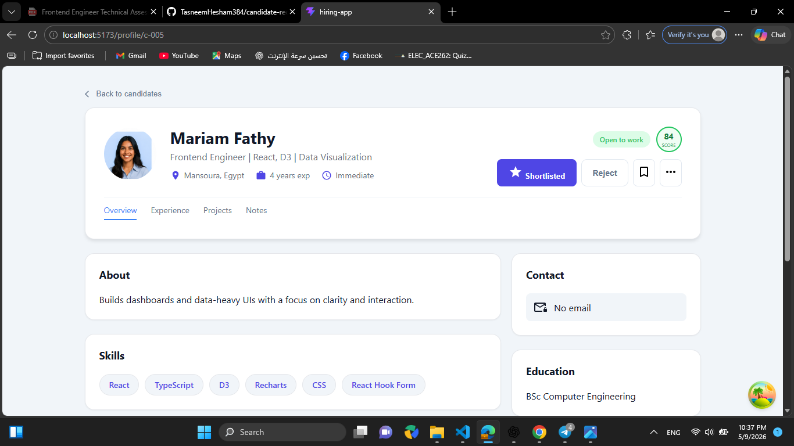
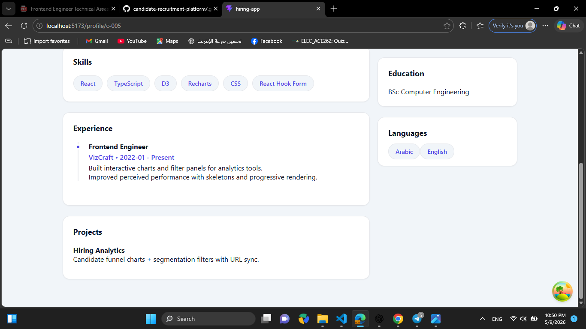
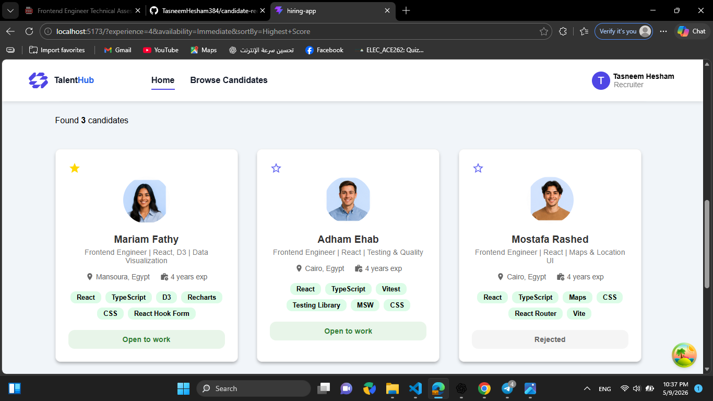

🚀 Modern Recruitment Portal

A scalable recruitment platform designed to simulate real-world hiring workflows with advanced filtering, candidate management, and performance-focused frontend architecture.

Built with React + Vite, this project emphasizes clean UI, efficient state management, and real-world frontend engineering practices.

⚙️ Setup Instructions
1. Install dependencies
npm install
2. Start mock server (IMPORTANT)
npx json-server src/data/db.json --port 3001
3. Run the frontend
npm run dev

The app will be available at:
👉 http://localhost:5173

🧰 Tech Stack
React
Vite
React Router
React Query (TanStack Query)
Context API
JSON Server (Mock API)
CSS / Design Tokens
✨ Feature Checklist

✔ Main Directory (Candidate Grid/List view of 20–40 candidates)

✔ Advanced Search (by Name, Skills, Headline)

✔ Multi-Filter System:

Location
Experience
Status

✔ Smart Sorting:

Recently Updated
Highest Score

✔ Active Filters UI (chips with remove functionality)

✔ Candidate Profile Page (/candidate/:id)

✔ Profile Actions:

Shortlist
Reject
State sync across app

✔ Navigation:

Back to home
Preserved filters & search state

✔ Responsive Design (mobile / tablet / desktop)

✔ UI States:

Skeleton Loading
Error State + Retry
Empty State
🏗️ Technical Focus (Implemented)
1. URL-driven State (Query Params)

Used useSearchParams to sync filters, search, and sorting with the URL.

✔ Enables deep linking
✔ Preserves state on refresh
✔ Improves shareability

2. State Management & Caching
React Context API for global UI actions (shortlist/reject)
React Query for API data fetching and caching

✔ Efficient data synchronization
✔ Reduced unnecessary requests

3. Performance Optimization

Used useMemo to optimize expensive filtering and sorting logic.

✔ Prevents unnecessary recalculations
✔ Improves UI responsiveness

4. Accessibility (a11y)
Semantic HTML (main, section, header)
Keyboard navigation support
Proper ARIA labels for inputs and buttons

✔ Better usability and inclusivity

📊 Data Approach
Mock API implemented using json-server
Simulated latency to mimic real-world network conditions
Enables skeleton loading states and realistic UX behavior
Client-side state updates simulate backend persistence during session
⚖️ Tradeoffs
Client-side vs Server-side Filtering

Filtering is handled on the client for fast UI response.

➡️ In a production-scale system (10k+ candidates), this logic should move to the backend with pagination and indexed queries.

Component Strategy

Custom components + CSS-based system used for flexibility.

➡️ A full Design System with strict tokens would be preferred in large-scale applications.

🚀 Next Improvements
Add unit & integration testing (Vitest + React Testing Library)
Implement Framer Motion animations for route transitions
Add dark mode using design tokens
Introduce pagination or infinite scroll
Improve backend integration (real API instead of mock server)
📌 Summary

This project demonstrates:

Strong React architecture
Real-world state management patterns
Advanced filtering & UX handling
Performance-aware frontend design
Production-minded engineering decisions

## 📸 Screenshots

### 🏠 Main Page

### 🔎 Filters & Stats

### 👥 All Candidates

### 📄 Candidate Profile

### 📄 Profile View 2

### 🎯 Filtered Results

❤️ Created by

Tasneem Hesham
